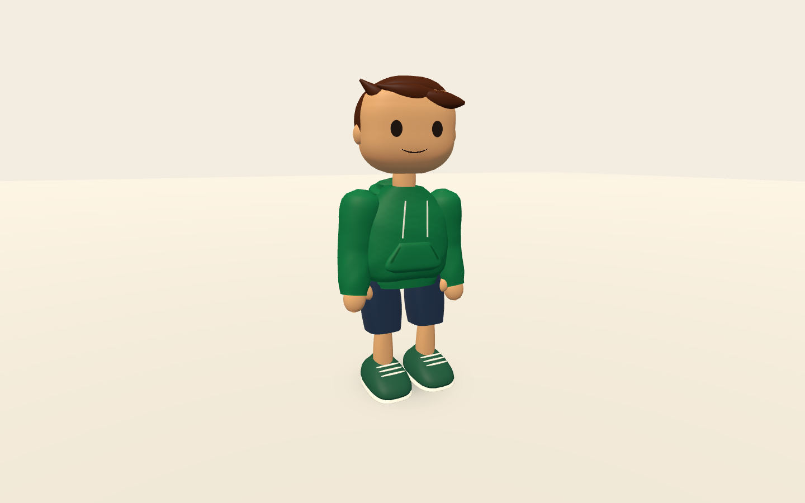
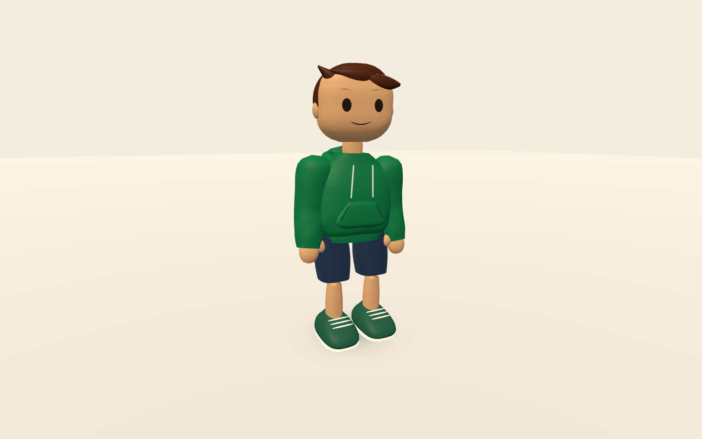
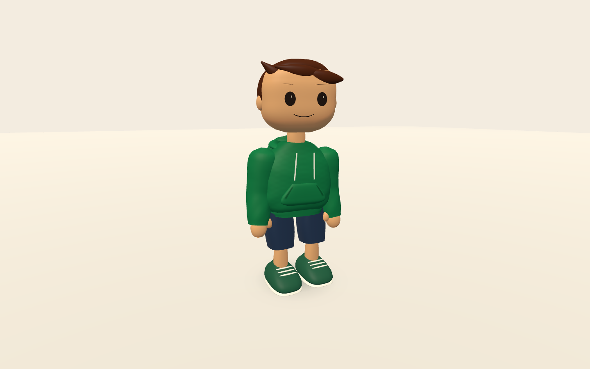

# Person studies

These are actual Rust renderer captures. **Visual approval is open.** Everyday
is the current working person/hoodie fit; the two alternatives are capture-only
studies with the same outfit, colors, light and camera.

| Everyday | Longer legs | Soft shoulders |
| --- | --- | --- |
|  |  |  |
| Small dark eyes, no brows, balanced proportions | Smaller head, longer legs, thin brows | Wider garment, dropped shoulders, larger head and eyes, quiet highlights |
| [Front](hero-front.png) · [Side](hero-side.png) · [Back](hero-back.png) | [Front](longer-front.png) · [Side](longer-side.png) · [Back](longer-back.png) | [Front](soft-front.png) · [Side](soft-side.png) · [Back](soft-back.png) |
| [Face](hero-face.png) · [Silhouette](hero-study-silhouette.png) · [Distance](hero-study-gameplay.png) | [Face](longer-face.png) · [Silhouette](longer-silhouette.png) · [Distance](longer-gameplay.png) | [Face](soft-face.png) · [Silhouette](soft-silhouette.png) · [Distance](soft-gameplay.png) |

[Greeting video](greeting.mp4) · [Side-on gait video](gait.mp4) ·
[Curious face](hero-curious.png) · [Wink](hero-wink.png)

[Wave](hero-wave.png) · [Wave without color or effects](hero-wave-silhouette.png)

The distance views use the gameplay orbit camera in the neutral studio. Also
review the daylight gameplay-camera fixture at [laptop size](gameplay-laptop.png) and
[phone size](gameplay-phone.png), including the existing portrait letterboxing.

## What changed

The person has connected anatomy, a visible neck, a hood behind the neck,
continuous elbow-bending sleeves, palm/thumb silhouettes, separated narrower
shoes and a swept hairstyle that wraps the back of the head. Small dark eyes
and a quiet smile replace the large cream/teal eyes and cheek/nose accents.
The everyday face omits brows; the other studies test thin brows on the same
head surface. Existing expression controls and player colors still work.

People no longer expose seam cores or expand joint gaps. Brief event sparks
remain an optional reduced-effects-controlled accent. No new species or
outfit IDs were added.

The fitted person pose keeps stance soles level at support height and lifts
the returning foot. Both knee rotations use the same bending convention.
Grounded placement uses explicit support; airborne and unknown-support actors
retain their rigged pose. Continuous sleeves use the existing elbow rotation,
not a cloth simulation or an extra skeleton.

## Review and remaining work

Use the three questions in [the art brief](../../character_art_direction.md):
would you choose this person while idle, does it stay connected while moving,
and does it work without decorative effects?

The greeting notices the viewer, smiles, waves, grins, winks and settles. The
side timeline covers idle, walk, run, jump, landing and wave. Travel is staged
in place; **level soles do not establish horizontal foot locking**. Matching
stride distance to actual travel and refining landing transitions still need
gameplay review. Hair needs softer shaping and follow-through; hands remain
simple mittens. The shoulder attachment is still rigid even though the sleeve
bends continuously at the elbow. These are direction studies, not finished
professional assets or evidence of preference testing with children.

## Reproduction and verification

See [runtime commands](../../character_runtime.md). Phase 9 saves 30 static
views plus 301 greeting frames and 301 side-on motion frames at 30 fps, sampled
from 60 Hz presentation. Only selected current views and encoded videos are
kept here. The fixture uses capability-selected AA; these views use 4× MSAA.

[Measured results](review-metrics.json) record the catalog and platform checks.
All 114 library tests and the six-outfit catalog validation pass. Metal,
browser WebGPU and browser GL validation pass. Native captures cover 390×844,
768×1024, 1280×800 and 1440×900. Tests cover mesh bounds/normals/indices,
level and separated stance feet over
a stride for all three studies, consistent knee direction, event-only seams,
and the existing engine/appearance regressions. Desktop Metal/WebGPU/GL
validation does not establish sustained physical-phone performance.
