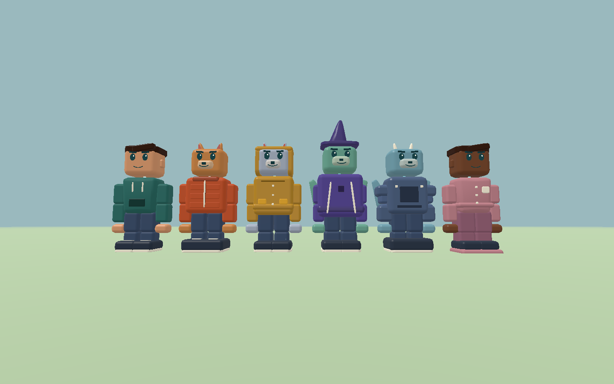
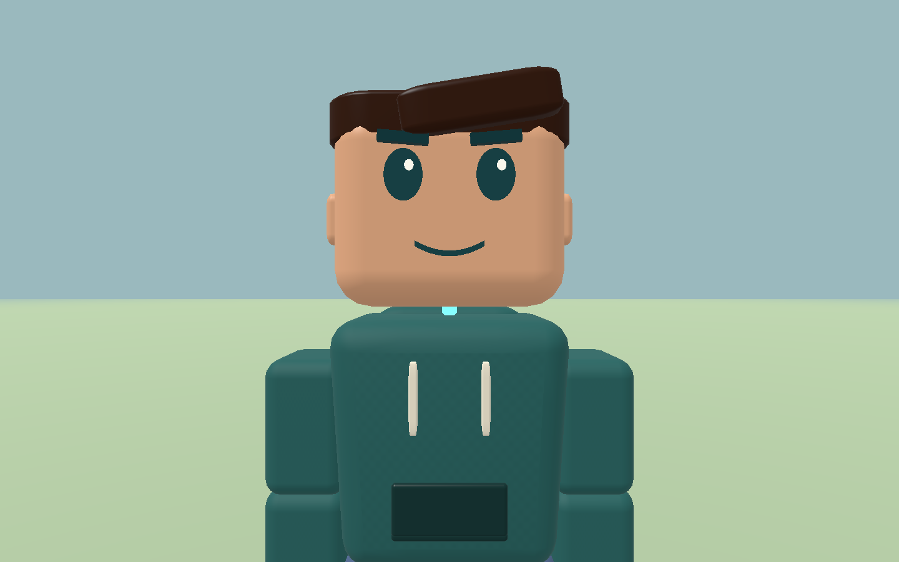

# Magic Characters: iOS camera and character polish

Reviewed and implemented September 5, 2026.

## Recording comparison

Used `ffprobe` to inspect all three supplied 2556×1180 iOS recordings and
`ffmpeg` to extract sequential frames at three-second intervals:

```sh
ffmpeg -i /Users/aa/Desktop/us.mov \
  -vf 'fps=1/3,scale=640:-1,tile=3x5' -frames:v 1 /tmp/us-review.jpg
```

The same extraction was performed for `step1.mov` and `step2.mov`. Their
durations are approximately 26.91, 20.58 and 36.73 seconds, respectively.
The recordings were inspected locally; they are not bundled with the repository.

`us.mov` repeatedly presents the back of the idle character during orbit.
`step1.mov` shows a stable front view, including close face inspection around
18 seconds. `step2.mov` demonstrates the much larger useful range between
close inspection, first person and a distant overhead view. These are visual
behavior references, not measurements of Roblox's internal camera constants.

## Review of the RFC phases

| Phase | Existing implementation and review finding |
| --- | --- |
| 0 — baseline | Deterministic capture tool and historical images exist. Device acceptance remains separate. |
| 1 — motion/geometry | Typed motion, rounded indexed meshes and snapshot regression tests exist. Legacy snapshot slot 3 is still camera yaw. |
| 2 — bodies | Three shared-rig bodies exist. Face offsets, muzzle occlusion, foot placement and appendage shapes needed refinement. |
| 3 — submission | Instancing, bounded caches, separate passes, color conversion and MSAA exist. The GPU validation crowd omitted its rig pose, collapsing parts at their origins; corrected in this follow-up. |
| 4 — motion | Locomotion, expression and secondary-motion code exists, but idle facing fell back to camera yaw, violating the intended separation between body and orbit. |
| 5 — wardrobe | Six outfits exist. The old wardrobe fixture captured only backs in one palette; garment details and silhouettes were not adequately reviewed. |
| 6 — quality | LOD, effect and residency limits exist. Physical sustained iOS/Android performance is still an open gate. |
| 7 — identity | Stable identities, revisions and compatibility APIs exist. A new body-heading accessor lets updated hosts replicate the body without changing the legacy snapshot. Two-client device verification remains open. |
| 8 — rollout | The reversible renderer switch exists. Prior captures and checked boxes do not establish final art approval or completion of mobile rollout gates. |

## Interaction changes

The local player retains a separate body heading. Third-person orbit never
changes idle body or head direction. Movement turns the body toward travel
using the shortest angular path; stopping retains that heading. First person
aligns the body with the view. Server position corrections preserve the user's
orbit, pitch and zoom. Explicit world/portal view resets retain their semantics.

Zoom uses a distance-scaled curve, with fine control close to the face and
larger travel at wide distances. The maximum distance increases from 48 to
120 engine units. iOS supplies logarithmic finger-spacing ratios and resets
the pinch baseline when the participating fingers change. UI-owned touches
retain their existing ownership, including the movement joystick.

The render camera blends its focus toward the eyes during close inspection,
uses the same yaw/pitch direction on both sides of first-person entry, and
stays above the ground. A local-only coverage fade prevents viewing the
inside of the character during entry. The existing camera has no wall sweep;
obstacle avoidance is not introduced by this change.

`engine_player_facing_yaw` is additive. The Rust header, iOS bridge/header and
browser frame adapter use it for body heading; the browser adapter keeps a
fallback for older binaries. Snapshot layout and camera-yaw slot semantics,
movement speed and gameplay collision dimensions are unchanged.

## Character changes

For the subsequent expression/motion review and repeatable animated capture,
see [Character review: expression and motion](magic_characters_motion_review.md).

The existing Soft Cubism direction remains: rounded cube heads, separate
rigid pieces, chunky hands and feet, and quiet magical seams. The visual
work follows the frontend skill's guidance on restraint and consistency.

- Graphic oval eyes, a single highlight and curved expression-driven mouths;
  face masks occupy only their front surface, and animal mouths sit in front
  of their muzzles.
- Sculpted swept hair and ears for the person; tapered ears, contrasting
  muzzle/inner ears and a tighter tail for the cat; tapered horns, broader
  wings and a skin-colored tail for the dragon.
- Corrected foot placement and distinct soles; hoodie cords, pocket and
  folded hood; puffer quilting and zipper; a wrapping rain hood, closures and
  pockets; a pointed wizard hat and cloak trim; armor rivets/belt; pajama
  buttons and pocket.
- Garment materials on the actual raincoat/armor/pajama surfaces, filtered
  cloth detail, and directional/hemisphere shading that better describes form.
- Outfit-aware head clearance and bounds that include scaled attachments.

Small construction details share an immutable mesh. The 48-part, 384-mesh,
32 MiB residency and 18-player simulation limits remain enforced. The capture
lineup uses explicit varied review palettes; existing live appearance tints
are not replaced by those fixture colors.

## Reproducible evidence

The [capture report](baselines/magic-characters/polish/phase5_report.json)
contains ten 1440×900 images: four wardrobe angles, close front/side views,
default front orbit, maximum overhead zoom, and first-person entry/exit.





```sh
cargo test --features dev-showcase
cargo check
rustup run stable cargo check --target wasm32-unknown-unknown --features web-renderer
cargo run --features dev-showcase --bin validate_character_assets
cargo run --features dev-showcase --bin magic_characters_capture -- \
  --phase 5 --width 1440 --height 900 --output docs/baselines/magic-characters/polish
cargo run --features dev-showcase --bin magic_characters_capture -- \
  --phase 3 --output /tmp/magic-polish-native
sh scripts/build_character_validation.sh
node scripts/validate_character_browser.mjs webgpu /tmp/magic-polish-webgpu
node scripts/validate_character_browser.mjs gl /tmp/magic-polish-gl
```

The suite includes idle orbit/hold, movement/stop, correction preservation,
reversible zoom, zoom limits, first-person view direction and camera transition
regressions. The GPU fixture now supplies actual rig poses and enforces its
effect depth-write comparison. Browser validation also exposed a derivative
in divergent shader control flow; derivatives now execute before all material
branches and discards.

Final checks passed: 102 Rust tests, native and WASM checks, asset validation,
Metal GPU validation, browser WebGPU and GL GPU validation, browser adapter
syntax checking, and the unsigned iOS arm64 application build. Native/WASM
checks retain the existing unused showcase-pose helper warning.

On the Apple M4 Max, the corrected 18-character 4× MSAA fixture used 51 draws,
747 instances, 95,616 upload bytes/frame, 215 cached meshes and 2,783,344 bytes
of character residency. Warm CPU p95 was approximately 1.30 ms. Surface-color,
opaque-occlusion and effect-depth comparison errors were zero. GPU timestamps
were too sparse for a reliable GPU p95. The mixed scene contains 99,516 mid-LOD
triangles; that remains above the RFC's provisional 3k-per-character triangle
aspiration and needs mobile budget ratification, despite passing the enforced
draw/upload/residency limits.

Native capture review additionally covers 390×844, 768×1024 and 1280×800,
including the existing portrait world letterboxing. The iOS application was
built for generic iOS/arm64 with signing disabled; no simulator was launched.
These are build and desktop rendering checks, not a new recording or sustained
performance measurement on a physical iPhone. Physical gesture feel, mobile
thermal behavior and cross-client reconnect remain device verification work.
